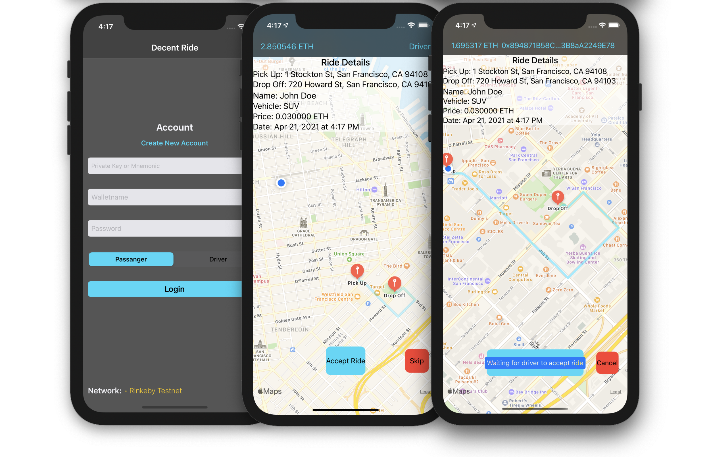
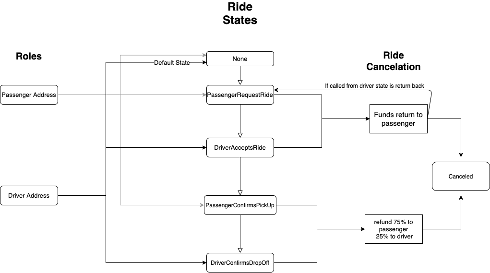
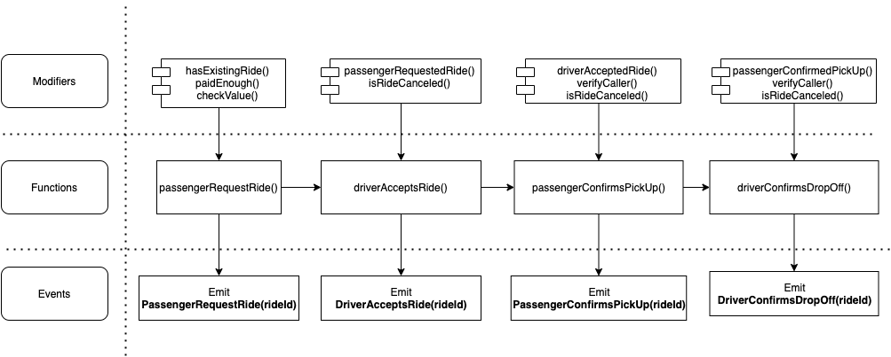
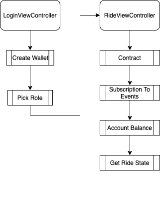
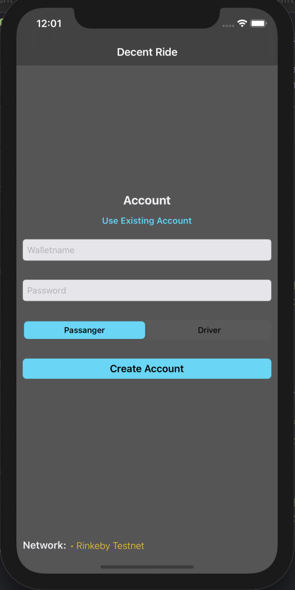
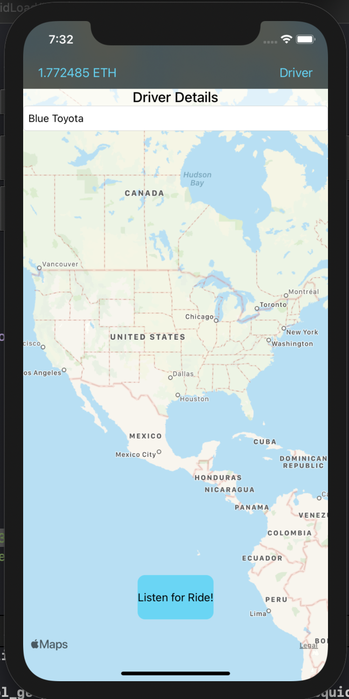
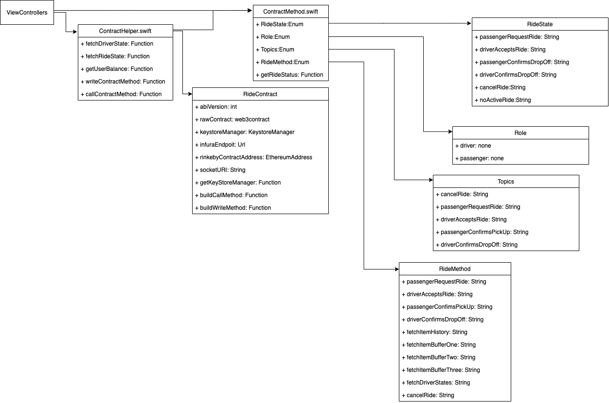

[]()


# Decentralized Ride Sharing 

This project demonstrates how a ride sharing architecture could be built and managed entirety by a smart contract within the Ethereum blockchain. Companioned by a iOS app provides a seamless experience.

---

  * [Requirements](#requirements)
  * [Project State](#project-state)
  * [Ride Architecture](#ride-architecture)
    + [Subscribtions ](#subscriptions-emitted-events)
  * [Findings](#findings)
    + [Upside](#upside)
    + [Potential Shortcomings](#potential-shortcomings)
    + [Bad Actors](#bad-actors)
  * [Components](#components)
    + [ Smart Contracts](#📄-smart-contracts)
    + [iOS App](#ios-app)
  * [Setup](#setup)
  * [Future Improvements](#future-improvements)
  * [License](#-licence)

---

## Requirements

- Contract
    - Truffle v5.1.62
    - Ganache GUI or CLI

- iOS dApp 
    - iOS 14.4+ 
    - Xcode 12.4+
    - Swift 5+
    

## Project State 

As of now this project is just a concept and the contract is only deployed on Rinkeby Test Network. I dont recommend deploying on the mainnet in the current state. There is more testing and overall improvements to be done.

### Contribute 

There are pently of parts that could be improved or extended therefore contribution is welcome. Go Wild!


## Ride Architecture

Simply the ride has four steps from start to finish, any where within the ride is cancable by either party. The contract keeps track of the steps by using 6 different ride states. These states cannot be skipped and only be called from the correct party. Here are some important topics for each state.

Passenger address is used as the ride ID for easy lookup and prevents a single address from having two outstanding rides.



- <b>Passenger Request Ride</b>

    - Passenger request a ride and is waiting for a driver to accept the ride. 
    - When the request is made, user sends price of ride in Ether which gets held by the contract.
    - Passenger get full refund if ride is canceled.

- <b>Driver Accepts Ride</b>

    - Driver has accept the ride and is waiting for user to confirm picked up.
    - When the driver accepts ride, user is notifiyed and the driver's Ether address is set within the ride.
    - Passenger get full refund if canceled. 
    - If canceled by driver, state will return to Passenger Request Ride.

- <b>Passenger Confirms Pick Up</b>

    - Passenger confirms pick up and is waiting to be drop off by driver.
    - Driver cut is 25%, passenger cut is 75% if canceled. 

- <b>Driver Confirms Drop Off</b>

    - Driver confirms dropping passenger off.
    - Driver paid out from the contract.
    - Ride cannot be canceled
    - Ride complete.
    
- <b>None</b>
    - Default state for all new address.
    
- <b>Canceled</b>
    - Ride has been canceled.
    
 
### subscriptions (Emitted Events)

Events are emitted when a contract method is called that changes the ride state. Thus by subscribing to events allows both partys to be notified with the new ride state or confirming the call was successful. 


## Findings

I found that a contract with too fews steps allows for easy manipulate. Too many steps get complicated and relys heavily on users. A four step contract enables driver and passenger to facilitate their roles without compication and eliminates bad actors to a degree. Possible a three step contract may also work. 

__Note: Refer to [Smart Contracts](#smart-contracts) segment of the read me for how this is programmed.__

### Upside

- Drivers get payed full amount of ride price. 

- Each party pays for their own tx cost.

- Level of anonymity protecting both parties.

- Trusted third party escrow.

- Crypto currency is a integrated payment method.

- Crypto wallets allows for easy logins.

### Potential Shortcomings

- This architeture does not support safety; "by adding a level of anonymity also comes a level danger".

- No support.

- Drivers are not background checked.

- Transaction time can take up to five minues.

- Fluctuating [gas price](https://www.investopedia.com/terms/g/gas-ethereum.asp).

- All transactions are public.

### Bad Actors 

Bad actors are always going to be part of any system. It is always important to do some due diligence on where and how bad they could take avantage. 

In certain states a 25 / 75% split is used to discourage bad acting when a ride is canceled. This prevents the driver being paid the full amount without taking the user to the correct location. 

__Check out Future Improvements for a possible solution to handle bad actors.__

 
## Components

### 📄 Smart Contracts 

Consists of three contracts written in Solidity. 

**Migrations.sol:** Allows upgrades to the ride contract by forking.

**Ownable.sol:**  Allows the ride contract to be killed if needed.

**Ride.sol:** Contains all the ride components, varables and methods. 

**Note:**  [Openzepplin's SafeMath.sol](https://docs.openzeppelin.com/contracts/2.x/api/math) is used to prevent overflows when doing math.

Ride.sol breaks down into five sections:

- Varaibles
- Events
- Modifiers
- Constructor / Deconstructor
- Functions
    
<b><u>Important code within ride.sol</u></b>

Ride state.

```c
enum State
{
  None,
  PassengerRequestRide,
  DriverAcceptsRide,
  PassengerConfirmsPickUp,
  DriverConfirmsDropOff,
  Canceled
}
```

 Struct containing ride component.

```c

struct RideItem {
  address ownerID;                      // Ethereum address of the owner
  address payable driverID;             // Ethereum address of the driver
  address payable passengerID;          // Ethereum address of the rider
  address rideID;                       // Ethereum addres of passengerRide ID 
  string  passengerName;                // Passenger name
  string  passengerVehicleRequestType;  // Passenger vehicleRequestType
  string  passengerPickUpAddress;       // Passenger pickup address
  string  passengerDropOffAddress;      // passenger dropoff address
  string  driverVehicleDiscription;     // drivers vehicleDiscription
  uint256 rideDate;                     // Ride Date: In Epoch
  uint    ridePrice;                    // Ride Price
  State   rideState;                    // Ride State as represented in the enum above
}

```

<b> Estimating Ride Cost</b>

Ride estimation can be implemented one of two ways;

- Oracles

Oracles enable smart contracts to request data outside the blockchain. This approach will increase transaction cost and finding a reliable oracle can be difficult. However, will keep a fair market value between passenger and driver.


- Dapps

Dapps could either make a request to a service that estimates ride cost or use built in methods that calcuate ride cost.  As of now estimating ride cost is done by the dapps providing a simpler contract. To keep a fair market drivers must be notified on passenger ride prices before accepting.


<b> Escrow </b>

Contract escrow works by using the contract address as the trusted third party. This allows for more flexability on how the funds are transferred based on the outcome of the requested ride.

- Passenger sends payment to contract address in the first step of the ride process (Passenger Request Ride).
- Contract will pay out to the driver when the last step of the contract is called (Driver Confirms DropOff).

<b> PassengerRequestRide </b>

Passenger request ride (`passengerRequestRide`) is a public function taking five parameters. These parameters are used for building a new ride. A new ride consists of an struct that holds components of the ride and mapped to the passenger address.  Before transferring ether from any accounts, modifiers are used to check ride state and the correct amount ether. If too much sent the remaining is returned back to sender. In order for ether to be received  the `payable` modifier is added to the function. Sent ether is automatically transferred to the contract address. This function does not return but instead emits an event along with the `rideId`. If subscribed to the topic, dapps will be notified about the newly requested ride. 




Passenger request ride function
Ride.sol 81-92
```c
function passengerRequestRide(
                                  string memory _passengerName,
                                  string memory _passengerPickUpAddress,
                                  string memory _passengerDropOffAddress,
                                  string memory _passengerVehicleRequestType,
                                  uint _ridePrice
                              ) public payable


  hasExistingRide(msg.sender)        // Check if passenger has a existing ride
  paidEnough(_ridePrice)             // Check if passenger has paid enough for ride
  checkValue(_ridePrice, msg.sender) // Check if passenger has over paid

  {
  
  string memory _driverName;                                            // Empty drivers Name
  string memory _driverVehicleDiscription;                              // Empty drivers vehicleDiscription
  
  RideItem memory newRide;                                              // Create a new struct RideItem in memory
  newRide.driverID = driverID;                                          // Ethereum address of the driver emtpy for now
  newRide.rideID = msg.sender;                                          // Ethereum address of the passenger is rideId
  newRide.passengerID = _make_payable(msg.sender);                      // Payable ethereum address of the passenger
  newRide.passengerName = _passengerName;                               // Passenger Name
  newRide.passengerPickUpAddress = _passengerPickUpAddress;             // Passenger pickup address
  newRide.passengerDropOffAddress = _passengerDropOffAddress;           // Passenger dropoff address
  newRide.passengerVehicleRequestType = _passengerVehicleRequestType;   // Passenger request for specific vehicle
  newRide.driverVehicleDiscription = _driverVehicleDiscription;         // Drive vehicle discription
  newRide.ridePrice = _ridePrice;                                       // Ride Price
  newRide.rideDate = now;                                               // Current date & time of ride
  newRide.rideState = State.PassengerRequestRide;                       // Ride State as represented in the enum above
  items[msg.sender] = newRide;                                          // Add newRide to items struct by upc

  uint placeholder;                                                     // Block number place holder
  Txblocks memory txBlock;                                              // create new txBlock struct
  txBlock.BlockPassengerPaymentSent = block.number;                     // add block number
  txBlock.BlockDriverPaymentSent = placeholder;                         // assign placeholder values

  itemsHistory[msg.sender] = txBlock;                                   // add txBlock to itemsHistory mapping by upc

  // Emit the appropriate event
  emit PassengerRequestRide(msg.sender);
}

```

<b> Driver Confirms Drop Off </b>

Driver Confirms Drop Off is a public function taking in a single parameter `rideId`. Ride id is an address used by modifiers and mapped to the correct ride. This ensures that the correct driver is paid. The driver is paid through the use of the transfer function. Also emitting the relative event.

Ride.sol 280-295
```c
function driverConfirmsDropOff(address _rideID) public
  passengerConfirmedPickUp(_rideID) // Checking previous state
  verifyCaller(items[_rideID].driverID) // Verifiying the caller is the driver of that ride
  isRideCanceled(_rideID) // Checking if the ride has been canceled
  {
    // Add block number to history mapping
    itemsHistory[ _rideID].BlockPassengerPaymentSent = block.number;
    // Update state
    items[ _rideID].rideState = State.DriverConfirmsDropOff;
    // Pay ride price to driver from contract
    items[ _rideID].driverID.transfer(items[_rideID].ridePrice);
    // Map drivers address to empty rideID
    driverRides[msg.sender] = address(0x0);
    // Emit DriverConfirmsDropOff event
    emit DriverConfirmsDropOff(_rideID);
}
```

### 📱 iOS App


The app design shoots for functionality and demonstration. It is worked in progress. Consisting of two view controllers (Login View Controller and Ride View Controller) and a Navigation controller. The app utilizes [Swift Web3 library](https://github.com/skywinder/web3swift) for all contract and wallet interactions. For simplicity, the single app is share between passenger and driver; working on two networks Ganache and Rinkeby.




**LoginViewController**

Allows a Ethereum wallet to be introduced to the app, either from an imported or a newly created wallet. When entering an imported wallet three things are needed.

- name
- password
- private key or mnomince.  

When a wallet is entered correctly the app will segue to Ride View Controller.

Network selection



**RideViewController**

Controller's main responsibility is to let the user (Driver or Passenger) know the state of the ride. Also provides a way to cancel or move the ride into the next state. The request for subscriptions is made, causing all emitted events to be handled by inheriting the `Web3SocketDelegate` protocol within the controller. Unfortunately, this includes events that are not related to the passenger or driver. A simple solution is to only acknowledge events with the same ride id. 



### Modularity

Global async functions are used that allow view controllers to make request to the ride contract. These async functions can be found in `ContractHelper.swift` and rely heavily on the PromiseKit libaray. `ContractMethods.swift` contains enums that are use to organize contract functions, ride states, roles and event topics. 

Topics allow for dapps to search or listen for specific events. Check out the [docs on events and logs](https://docs.soliditylang.org/en/develop/contracts.html?highlight=topic#events)



### Subscriptions

Web3 provides the fundamentals on creation and management of Infrua websockets. Additional methods are used to extend the capabilities to Ganache. 

`createSocket` method within `RideViewControllerExt.swift` .

This method can be simplified to do the following.

1. Create a new socket
2. Set the delegate  
3. Wait for a connection

When connection is established, commands are sent to the socket with specifics of events and contracts to subscribe. For simplicty we subscribe to all events topics that are emitted by the given contract address. Check out upgrades on how this could be optimized. In order for the app to understand what topics are received, a enum is used to match topics to methods. Ride view controller inherits the `Web3SocketDelegate` protocol this adds two functions, `received` and `gotError`. 

- received: Receives new emit topics.
- gotError: Error occurred server side.

### Contract Abi

An abi (Application Binary Interface) is used allowing the app (web3) to understand what contract methods are avaliable. This can be found when the contract is compiled. Abi is needed for Web3 to construct the contract. `ContractAbi.swift` contains the contract abi.

---

## Setup

<b>Currently being worked on!</b>

## Future Improvements

 - Calculating ride cost based on distance and current price of gas for a location.
 
 - Adding a driver rating and location system.
 
 - Integrate a tipping system.
 
 - Add award system for good behavior.
 - Add a three stike system for bad behavior.
 - Use a custom ERC721 token that can be locked when too much bad behavior.

## 🔖 Licence

The project is available under MIT licence
